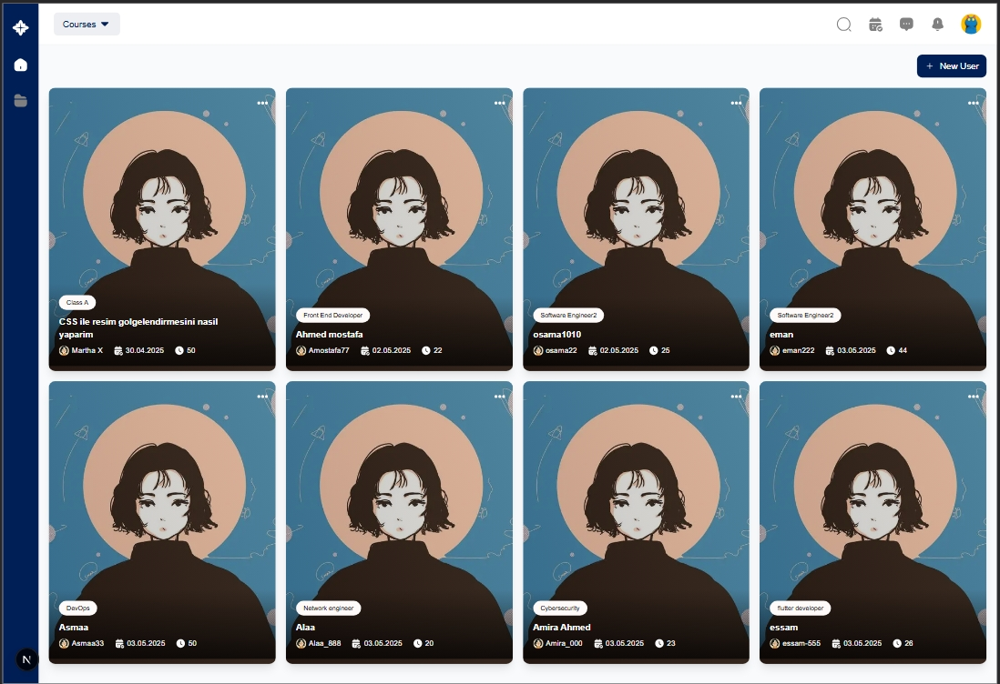
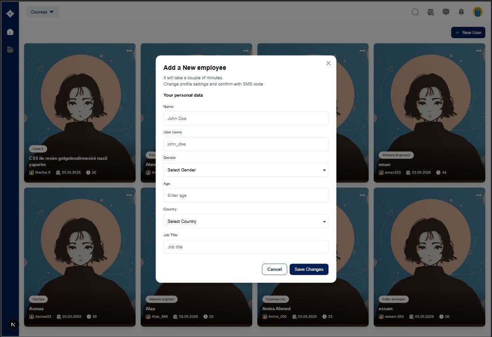
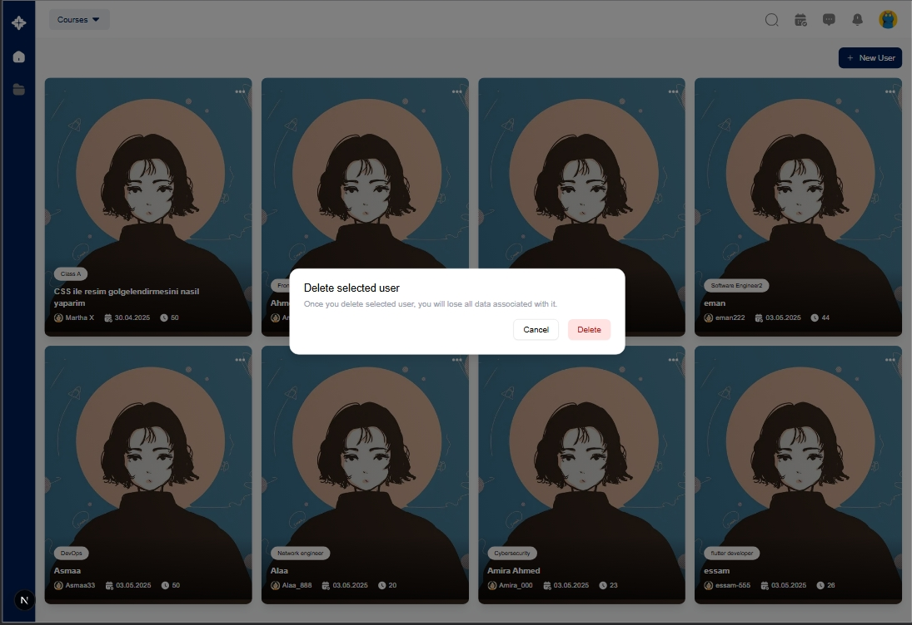

# Bronto24 User Management System

A modern, responsive user management application built with Next.js, TypeScript, React Query, and Tailwind CSS. This application demonstrates best practices for building scalable React applications with a focus on component reusability, efficient state management, and clean user interface design.

## Table of Contents

- [Features](#features)
- [Prerequisites](#prerequisites)
- [Installation](#installation)
- [Project Structure](#project-structure)
- [Screenshots](#screenshots)
- [Technologies Used](#technologies-used)

## Features

- User Management: Create, read, update, and delete user profiles
- Responsive Design: Optimized for both desktop and mobile devices
- Modern React Patterns: Leverages React 19 and Next.js 15.3.1
- Efficient State Management: Uses React Query for data fetching and caching
- Form Validation: Implements Zod for robust form validation
- Accessible UI Components: Built with Radix UI primitives
- Toast Notifications: Provides user feedback with Sonner

## Prerequisites

- Node.js 18.x or higher
- npm, yarn, pnpm, or bun

## Installation

1. Clone the repository:

   ```bash
   git clone https://github.com/mohamedsaeed22/bronto24-assessment.git
   cd bronto24-assessment
   ```

2. Install dependencies:

   ```bash
   npm install
   # or
   yarn install
   # or
   pnpm install
   # or
   bun install
   ```

3. Start the development server:

   ```bash
   npm run dev
   # or
   yarn dev
   # or
   pnpm dev
   # or
   bun dev
   ```

4. Open http://localhost:3000 with your browser to see the application.

## Project Structure

```
bronto24-assessment/
├── public/
│   ├── icons/
│   ├── images/
│   ├── screenshots/
├── src/
│   ├── app/
│   ├── components/
│   │   ├── form/
│   │   ├── ui/
│   │   ├── user/
│   │   ├── layout/
│   ├── hooks/
│   ├── lib/
│   ├── providers/
│   └── types/
├── package.json
└── README.md
```

## Key Components

- UI Component Library: Reusable UI components built with Radix UI primitives and Tailwind CSS
- Form System: Integrated form handling with react-hook-form and Zod validation
- React Query Provider: Centralized data fetching and state management
- User Management: Components for displaying and manipulating user data

## Screenshots

- 
- 
- 

## Technologies Used

- Framework: Next.js 15.3.1, React 19
- State Management: React Query (TanStack Query)
- Form Handling: react-hook-form, Zod validation
- UI Components: Radix UI, Tailwind CSS
- HTTP Client: Axios
- Notifications: Sonner (toast notifications)
- Development: TypeScript
